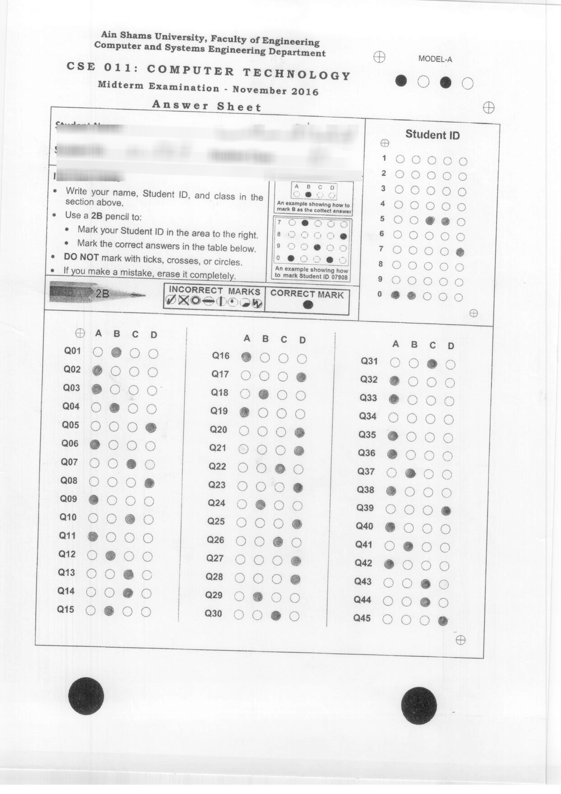
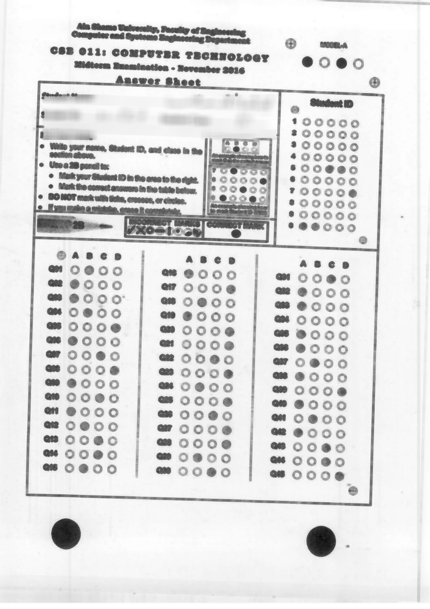
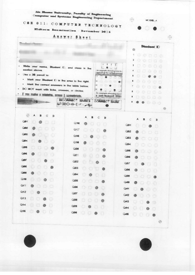
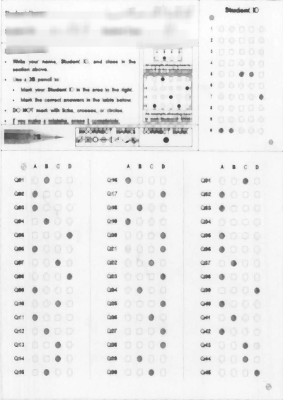
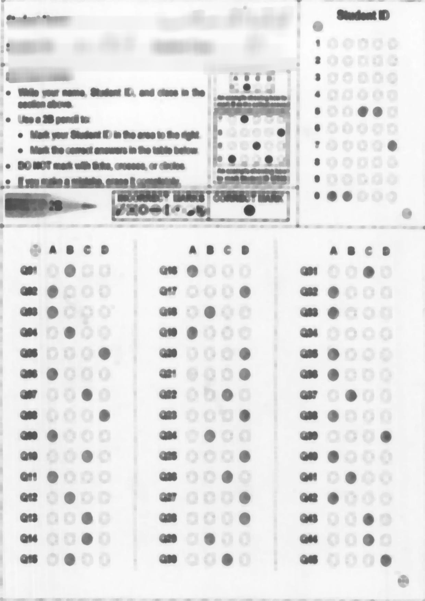
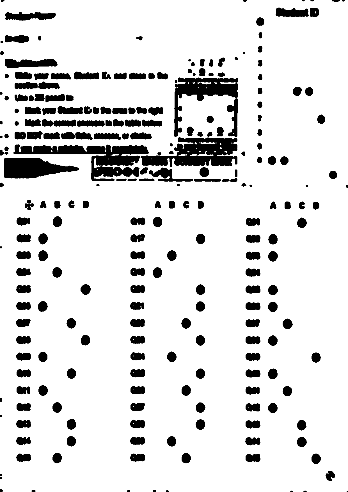

# Bubble Sheet Scanner
 computer vision system that uses java and openCV library to read and grade bubble sheet tests.   

<h1> this system perform the following steps to grade student sheet:- </h1>
>> here is the sheet image:-  
    
1- erode the sheet image  
  
2- dilate the eroded image  
  
3- detect the centers of the two bottom circles using Hough Transform. using these centers we can  
calculate the corners coordinates of the slanted sheet image.  
4- wrap the dilated  sheet image using the matrix of corner coordinates of slanted image 
  
5- erode the wraped sheet image  
  
6- perform thresholding to make student shaded circles very clear  
  
7- by calculating the intenisity of answer circles, one can determine which circle is
shaded..and if there are more than one shadded circle..then the answer is considered wrong.  
8- student grade can be calculated by comparing the model answers which is hard coded by the
student answers. 
9- student grade is printed out to the console. 

